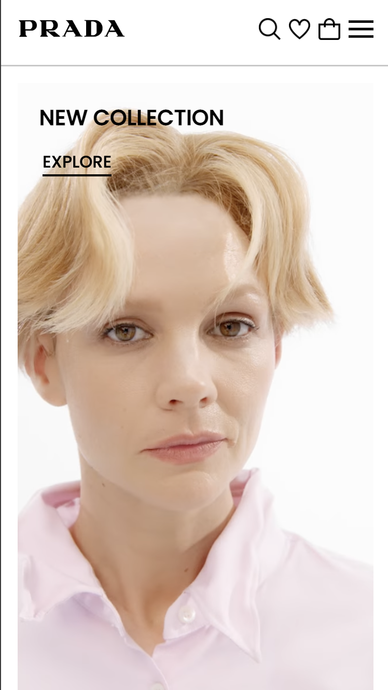

## Welkom op mijn Readme! hier documenteer ik wat ik heb gedaan.

  ### Auteur:
  Soufiane Ayaou 

  #### Je startniveau:
  Rood (kies uit zwart, rood óf blauw)

  #### Je focus:
  Responsive 
 

## Je website

  ### Je opdracht:

  Dit is de website die ik ga namaken
  https://www.prada.com/us/en.html

  #### Screenshot(s) van de eerste pagina (small screen): 
Homepage   

  #### Screenshot(s) van de tweede pagina (small screen):
Itempagina 

 

## Toegankelijkheidstest 1/2 (week 1)

Toegankelijk is van belang bij het ontwerpen van een website dat voor iedereen, met een beperking of niet, is bedoeld. 

Met deze toegangkelijkheidstest bekijk ik hoe de Prada website voldoet aan de toegankelijkheid voor alle gebruikers met behulp van een screen reader en beperkingen. 

  ### Bevindingen
  Lijst met je bevindingen die in de test naar voren kwamen:

  bril met vlek:
  - 80% van de scherm is niet te lezen. 
  - inzoomen heeft een beetje nut om wat meer van de scherm te kunnen lezen.
  - enkel het deel van de linker- en rechterkant van het scherm is nog te zien.
  - De afstand tot het scherm bepaald op je het scherm beter ziet of niet.

  bril met kleine gaatjes:
  - scherm is nog prima te lezen.
  - moeilijk het geheel in een keer te zien.
  - moet aandachtig gaan zoeken om te navigeren.
  - moet dichtbij het scherm kijken om het scherp te kunnen zien. 

  screen reader:
  - geen h1 op homepage.
  - de kopjes worden goed voorgelezen
  - de elementen in de navgiatie-balk wordt niet gezien als linkjes, maar als formulierregelaars. Dit geldt ook voor de social media icoontjes. 
  - in de footer staan er ook linkjes, maar deze worden ook niet erkent als linkjes, maar als een kop. 

  ### Screenshots checklist
  
  
  

## Breakdownschets (week 1)

  
  Voordat ik begon met het namaken van de site in SVG, heb ik een breakdownschets gemaakt om het opzetten van mijn site voor mezelf gemakkelijker te maken.

  ### Breakdownschets de hele pagina: 
  

  ### Breakdownschets dynamisch deel (bijv menu): 
  

## Toegankelijkheidstest 2/2 (week 4)

  ### Bevindingen
  Lijst met mijn bevindingen die in de test naar voren kwamen:

  - screenreader leest nu alle linkes goed.
  - headers leest het goed.
  - alt tekst ben ik bij sommige afbeeldingen vergeten. 

  ### Screenshots checklist
  
  
  
  
  

## Voortgang 3 (week 4)

  
uitwerken voor 3e voortgang

  ### Stand van zaken
  Voordat ik aan de herkansing van dit vak ben begonnen had ik al een heel groot deel van de site af.
  Ik moet nog alleen vaststellen wat ik ga toevoegen of bewerken aan de site.

  ### Verslag van meeting
  hier na afloop snel de uitkomsten van de meeting vastleggen

- probeer lementen 1 op 1 na maken
- footer moet meer lijken op de originele
- mappen op github opschonen. oude documenten weghalen.
- animeren sluiten hamburger menu
- elementen in de hamburger van originele ook overnmen
- custom properties kleuren gebruiken in je kleuren.
- readme toevoegen.
- oe ook surface plain--> voor een hoger cijfer

## Eindgesprek (week 5)

  
uitwerken voor eindgesprek

  ### Je uitkomst - karakteristiek screenshots:
  
  
  
  

  Ik ben blij met de uitkomst. Ik heb veel geleerd, met name met responsive werken en dingen positioneren. Ook ben ik veel beter geworden in het oplossen van problemen binnen mijn code. 

  ### Dit ging goed/Heb ik geleerd: 
  Korte omschrijving met plaatjes

  

  ik heb geleerd hoe ik een hamburgermenu maak. Ik vond het op het begin erg lastig, met name het onderdeel met javascript, maar het is me toch wel gelukt!

  Verder was met een grid werken voor mij nieuw. Deze functie heeft mij enorm veel geholpen bij het maken van de website. 

  
  
  Een navbar maken vond ik altijd erg lastig en ik was er altijd erg lang mee bezig en begreep het niet helemaal. Nu ik de opdrachten die ik tijdens de lessen heb gemaakt, begrijp ik het en is het eigen echt makkelijk geworden.

  ### Dit was lastig/Is niet gelukt:

Wat ik erg lastig vond aan het bouwen van mijn site is het werken met javascrip voor de hamburgermenu. Ik vind javascrip echt lastig vanwege de taal waarmee je moet werken (vind ik gewoon lastig te begrijpen. ik heb hulp gevraagd aan docenten, leerlingen en ik heb de lesopdracht van de hamburgermenu ook gemaakt. Dit heeft me toch wel geholpen bij het maken van de hamburgermenu. 

  

## Bronnenlijst

  
continu bijhouden terwijl je werkt

  Nb. Wees specifiek ('css-tricks' als bron is bijv. niet specifiek genoeg). 
  Nb. ChatGpT en andere AI horen er ook bij.
  Nb. Vermeld de bronnen ook in je code.

  1. Bij het maken van de form (email) --> https://www.w3schools.com/howto/tryit.asp?filename=tryhow_css_register_form en https://www.toptal.com/designers/htmlarrows/arrows/ 
  2. Voor de video die automatisch afspeeld en bediend kan worden --> https://www.w3schools.com/tags/att_video_autoplay.asp 
  

