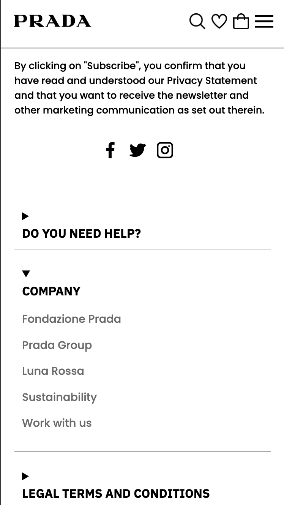
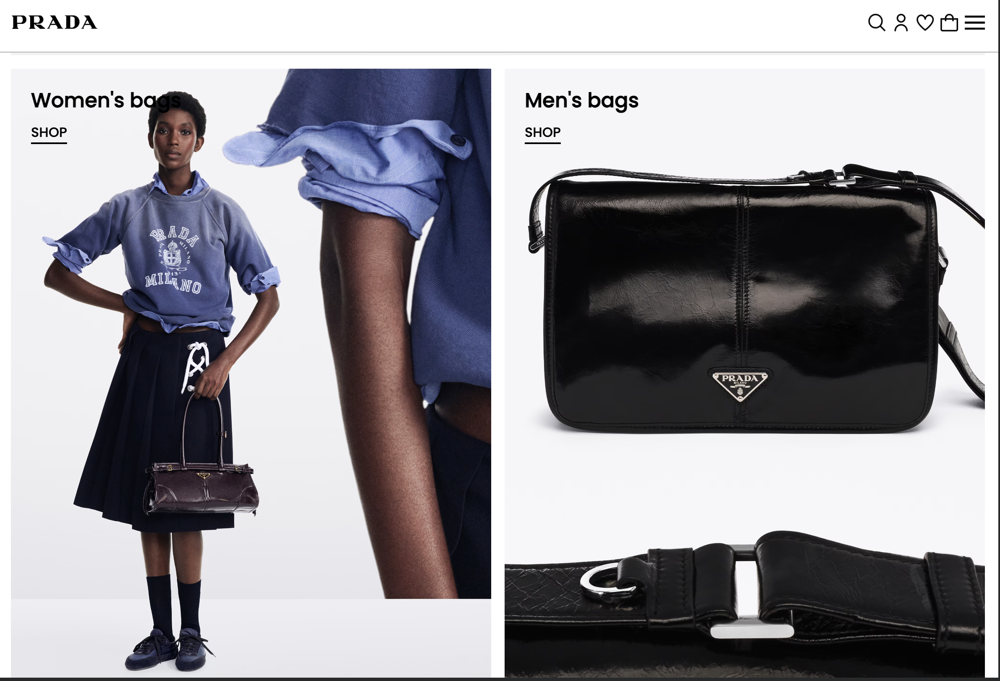
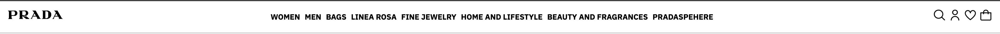

# Procesverslag
Markdown is een simpele manier om HTML te schrijven.  
Markdown cheat cheet: [Hulp bij het schrijven van Markdown](https://github.com/adam-p/markdown-here/wiki/Markdown-Cheatsheet).

Nb. De standaardstructuur en de spartaanse opmaak van de README.md zijn helemaal prima. Het gaat om de inhoud van je procesverslag. Besteedt de tijd voor pracht en praal aan je website.

Nb. Door *open* toe te voegen aan een *details* element kun je deze standaard open zetten. Fijn om dat steeds voor de relevante stuk(ken) te doen.

## Jij

  
uitwerken voor kick-off werkgroep

  ### Auteur:
  Soufiane Ayaou (vervangen door jouw naam)

  #### Je startniveau:
  Rood (kies uit zwart, rood óf blauw)

  #### Je focus:
  Responsive (kies uit responsive óf surface plane)
 

## Je website

  
uitwerken voor kick-off werkgroep

  ### Je opdracht:
  https://www.prada.com/us/en.html

  link naar de website die je gaat namaken óf de naam/omschrijving van je eigen ontwerp

  #### Screenshot(s) van de eerste pagina (small screen): 
Homepage   

  #### Screenshot(s) van de tweede pagina (small screen):
  Resultatenpagina  
  
 

## Toegankelijkheidstest 1/2 (week 1)

  
uitwerken na test in 2e werkgroep

Toegankelijk is van belang bij het ontwerpen van een website dat voor iedereen, met een beperking of niet, is bedoeld. 
Met deze toegangkelijkheidstest bekijk ik hoe de Prada website voldoet aan de toegankelijkheid voor alle gebruikers met behulp van een screen reader en beperkingen. 

  ### Bevindingen
  Lijst met je bevindingen die in de test naar voren kwamen:

  bril met vlek:
  - 80% van de scherm is niet te lezen. 
  - inzoomen heeft een beetje nut om wat meer van de scherm te kunnen lezen.
  - enkel het deel van de linker- en rechterkant van het scherm is nog te zien.
  - De afstand tot het scherm bepaald op je het scherm beter ziet of niet.

  bril met kleine gaatjes:
  - scherm is nog prima te lezen.
  - moeilijk het geheel in een keer te zien.
  - moet aandachtig gaan zoeken om te navigeren.
  - moet dichtbij het scherm kijken om het scherp te kunnen zien. 

  screen reader:
  - geen h1 op homepage.
  - de kopjes worden goed voorgelezen
  - de elementen in de navgiatie-balk wordt niet gezien als linkjes, maar als formulierregelaars. Dit geldt ook voor de social media icoontjes. 
  - in de footer staan er ook linkjes, maar deze worden ook niet erkent als linkjes, maar als een kop. 

## Breakdownschets (week 1)

  
uitwerken na afloop 3e werkgroep

  ### de hele pagina: 
  

  ### dynamisch deel (bijv menu): 
  

## Voortgang 1 (week 2)

  
uitwerken voor 1e voortgang

  ### Stand van zaken
  hier dit ging goed & dit was lastig (neem ook screenshots op van delen van je website en code)
 
 Dit ging goed:
 - HTML opstellen
 - Begin maken aan css
 - flexbox onder de knien krijgen
 
 Dit was lastig:
 - Functionerende hamburgermenu maken
 - sections op verschillende pagina's aanspreken in css zonder gebruik te maken van classes.
 

  ### Agenda voor meeting
  samen met je groepje opstellen

  | Bibi            | Tim         | Felix    | Soufiane       |
  | ---            | ---                | ---          | ---              |
  | - Typografie opdracht lastig
  | - Misschien andere site doen (Guess)          | - Keuze lastig responsive of surfaceplane             | Web raar ingedeeld, hoe dat aanpakken?. HTML in orde?       | HTML in orde?    |

  ### Verslag van meeting
  hier na afloop snel de uitkomsten van de meeting vastleggen

  - logo is h1--> alt: homepage prada
  - navigatie icoontjes kunnen nav worden--> kan ook toegevoegd worden bij de listitems.
  - te veel sections--> zijn de sections echt nodig?
  - op de resultatenpagina kun je de afbeedlingen (producten) als articles gebruiken. 
  - navigatie mag simpeler. 
  - productpagina is beter dan homepage--> homepage is onoverzichtelijk.
  - je kunt de homepage verbeteren. 
  - language aanpassen naar dezelfde language als de pagina.
  - voeg eventueel een formulier toe voor hoger cijfer.

## Voortgang 2 (week 3)

  
uitwerken voor 2e voortgang

  ### Stand van zaken
  hier dit ging goed & dit was lastig (neem ook screenshots op van delen van je website en code)

  ### Agenda voor meeting
  samen met je groepje opstellen

  | student 1      | student 2          | student 3    | student 4        |
  | ---            | ---                | ---          | ---              |
  | dit bespreken  | en dit             | en ik dit    | en dan ik dat    |
  | en dat ook nog | dit als er tijd is | nog een punt | dit wil ik zeker |
  | ...            | ...                | ...          | ...              |

  ### Verslag van meeting
  hier na afloop snel de uitkomsten van de meeting vastleggen

  - let op op order van h1, h2 enz.
  - niet te veel sections gebruiken.
  - mag meerdere css documenten aanmaken. 

## Toegankelijkheidstest 2/2 (week 4)

  
uitwerken na test in 9e werkgroep

  ### Bevindingen
  Lijst met je bevindingen die in de test naar voren kwamen (geef ook aan wat er verbeterd is):

  - screenreader leest nu alle linkes goed.
  - headers leest het goed.
  - alt tekst ben ik bij sommige afbeeldingen vergeten. 

## Voortgang 3 (week 4)

  
uitwerken voor 3e voortgang

  ### Stand van zaken
  hier dit ging goed & dit was lastig (neem ook screenshots op van delen van je website en code)

  ### Agenda voor meeting
  samen met je groepje opstellen

  | soufiane      | student 2          | student 3    | student 4        |
  | ---            | ---                | ---          | ---              |
  | dit bespreken  | en dit             | en ik dit    | en dan ik dat    |
  | en dat ook nog | dit als er tijd is | nog een punt | dit wil ik zeker |
  | is mijn hamburgermenu goed?
    moet ik alle knoppen interactief maken?          | ...                | ...          | ...              |

  ### Verslag van meeting
  hier na afloop snel de uitkomsten van de meeting vastleggen

  - named grids zijn handig
  - focus state kun je vormgeven
  - hamburgermenu mot van de lesopdracht komen
  - zoekelementen en andere interactieve elementen hoeven niet werkend te zijn. 
  - richt je met name op responsive
  - maak je site aantrekkelijker met hovers. 
  - het is leuk als je je richt op ook hele kleine schermen, maar dat hoeft niet. minimaal schermen van 320px breed. 
  - de horizontal slidebar op de product pagina moet wat afstand doen van de tekst.
  - inputype email is handig voor op telefoons, want dan heeft de toetstenboard email elementen. 
  - form element moet je verbeteren. 
  - je mag divs gebruiken om te stijlen als een groepering geen betekenis heeft. als er een andere tag is die de groepering beter beschrijft dan moet je dat element gebruiken. 

## Eindgesprek (week 5)

  
uitwerken voor eindgesprek

  ### Je uitkomst - karakteristiek screenshots:
  
  

  Ik ben trots op wat ik in een korte tijd heb kunnen maken. Ik heb veek geleerd, met name met responsive werken en dingen positioneren. 

  ### Dit ging goed/Heb ik geleerd: 
  Korte omschrijving met plaatjes

  
  ik heb geleerd hoe ik een hamburgermenu maak. Ik vond het op het begin erg lastig, met name het onderdeel met javascript, maar het is me toch wel gelukt!

  Verder was met een grid werken voor mij nieuw. Deze functie heeft mij enorm veel geholpen bij het maken van de website. 

  
  Een navbar maken vond ik altijd erg lastig en ik was er altijd erg lang mee bezig en begreep het niet helemaal. Nu ik de opdrachten die ik tijdens de lessen heb gemaakt, begrijp ik het en is het eigen echt makkelijk geworden.

  ### Dit was lastig/Is niet gelukt:

Wat ik erg lastig vond aan het bouwen van mijn site is het werkeh met javascrip voor de hamburgermenu. Ik vind javascrip echt lastig vanwege de taal waarmee je moet werken (vind ik gewoon lastig te begrijpen. ik heb hulp gevraagd aan docenten, leerlingen en ik heb de lesopdracht van de hamburgermenu ook gemaakt. Dit heeft me toch wel geholpen bij het maken van de hamburgermenu. 

  

## Bronnenlijst

  
continu bijhouden terwijl je werkt

  Nb. Wees specifiek ('css-tricks' als bron is bijv. niet specifiek genoeg). 
  Nb. ChatGpT en andere AI horen er ook bij.
  Nb. Vermeld de bronnen ook in je code.

  1. Bij het maken van de form (email) --> https://www.w3schools.com/howto/tryit.asp?filename=tryhow_css_register_form en https://www.toptal.com/designers/htmlarrows/arrows/ 
  2. Voor de video die automatisch afspeeld en bediend kan worden --> https://www.w3schools.com/tags/att_video_autoplay.asp 
  

